# 26RC浮舟湿地马术rl训练开源

## 目录

- [开源引用](#开源引用)
- [简介](#简介)
- [效果展示](#效果展示)
  - [训练数据展示](#训练数据展示)
  - [课程学习效果](#课程学习效果)
  - [终止情况](#终止情况)
- [项目依赖环境](#项目依赖环境)
- [编译安装方式](#编译安装方式)
- [项目结构](#项目结构)
- [系统框图和数据流图](#系统框图和数据流图)
- [原理介绍以及理论支撑](#原理介绍以及理论支撑)
  - [1. PPO 近端策略优化算法](#1-ppo-近端策略优化算法)
  - [2. Actor-Critic 架构与网络设计](#2-actor-critic-架构与网络设计)
  - [3. 域随机化 (Domain Randomization)](#3-域随机化-domain-randomization)
  - [4. 课程学习 (Curriculum Learning)](#4-课程学习-curriculum-learning)
  - [5. 奖励函数设计](#5-奖励函数设计)
  - [6. 步态相位与足端轨迹优化](#6-步态相位与足端轨迹优化)
  - [7. 执行器网络与 Sim-to-Real 迁移](#7-执行器网络与-sim-to-real-迁移)
  - [8. 周期性停止命令与鲁棒性](#8-周期性停止命令与鲁棒性)
  - [10. GAE 广义优势估计](#10-gae-广义优势估计)
- [软件架构](#软件架构)
  - [1. 训练结构](#1-训练结构)
  - [2. 软件层级图](#2-软件层级图)
- [训练流程](#训练流程)
- [机器人配置文件](#机器人配置文件)
- [未来优化的方向（RoadMap）](#未来优化的方向roadmap)

## 开源引用
本仓库基于 [Fan Ziqi/robot_lab](https://github.com/fan-ziqi/robot_lab) 二次开发。

- **原始项目 License**: Apache-2.0
- **原始作者**: FanZiqi

其中借鉴了[云深处lite3](https://github.com/DeepRoboticsLab/rl_training)关于步态的奖励和课程学习设计
## 简介
在robot_lab训练框架下训练rc的四足，可以实现45维观测的四足强化学习模型的训练，完成具有较强的鲁棒性的平地运控模型，该模型可以实现rc26马术障碍赛中的平地，斜坡，绕桩，沙石地的越障，还可以训练出无相机或雷达，只基于自身电机位置观测和imu观测的上下楼梯运动，楼梯高度在15cm以下都可以稳定运行。
## 效果展示
- 以3m/s的速度稳定运行在起伏粗糙地形

- 以2m/s的速度上下楼梯

### 训练数据展示
**1. 第一轮训练（全ramdom_rough地形未开period_stop事件）**
- 行走速度学习：直线达到2m/s
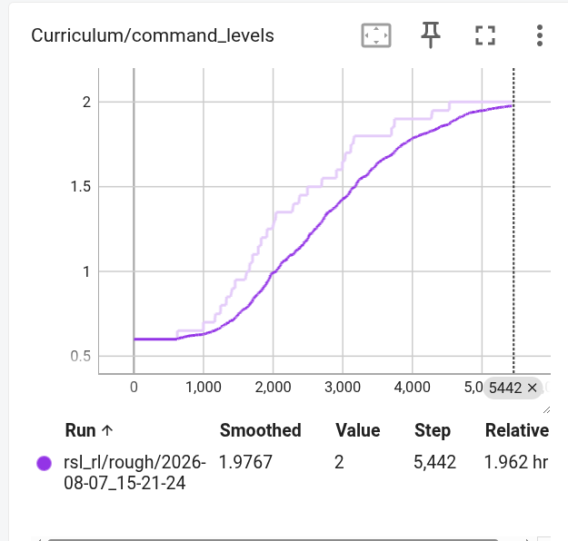 
- 每个机器人的平均奖励值：持续上升到了一个较高的值

- 速度与角速度与期望的差:误差持续下降
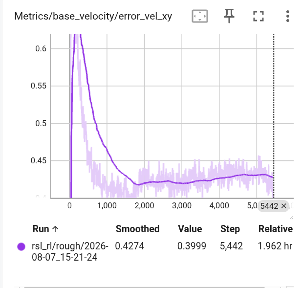  
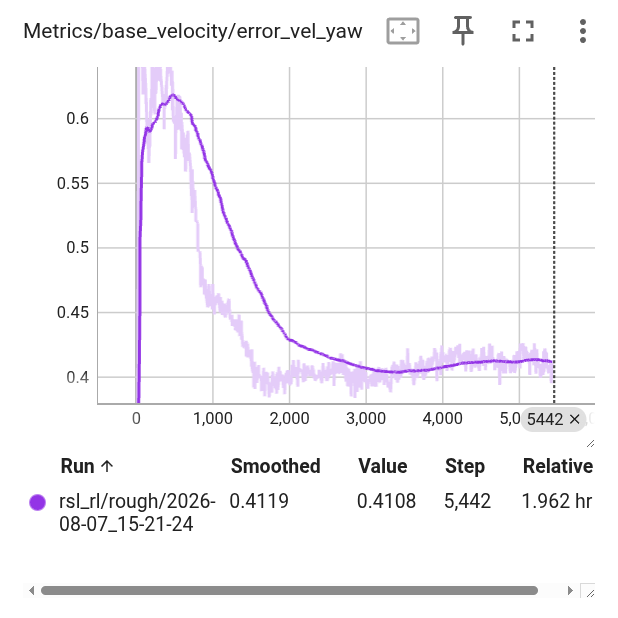  
- 终止情况：可以看到还是有一定的翻倒情况但存活到时间结束保持在95%以上
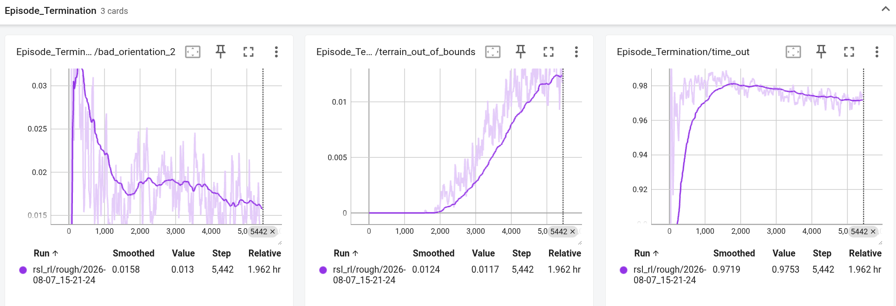 
### 课程学习效果
#### 1. command_levels 第一轮训练中没有用period_stop在5400轮左右到达2m/s
 

#### 2. command_level_ang_vel
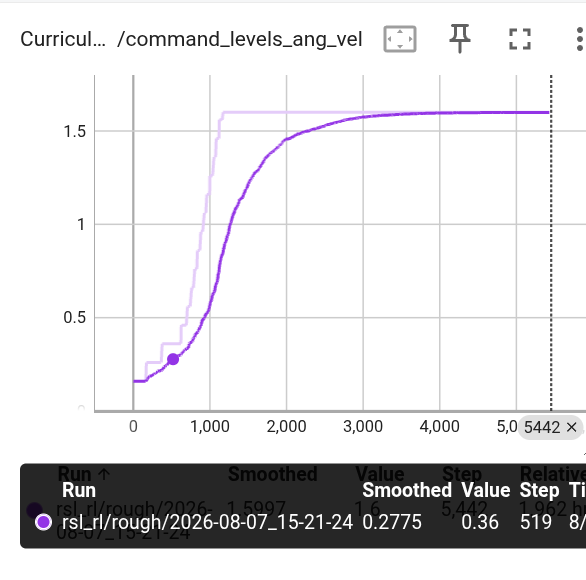 

#### 3. terrain_levels 第一轮训练中
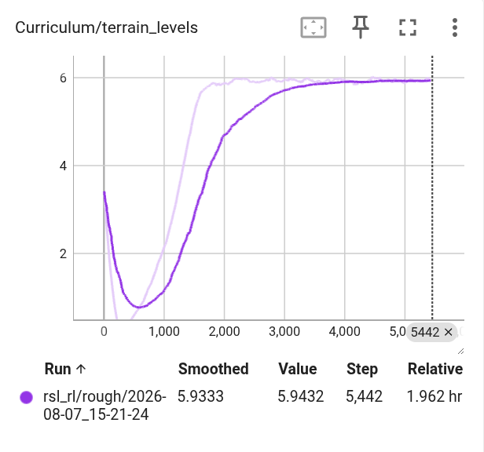 

#### 4. gait_levels 
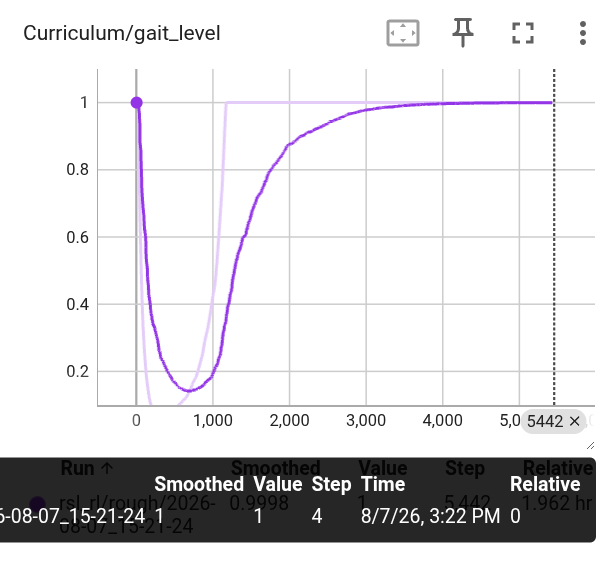 

### 终止情况
#### 第一轮 
可以看到还是有一定的翻倒情况
 

#### 第二轮
在开了急停急起并且增加斜坡的情况下翻倒情况低于0.015
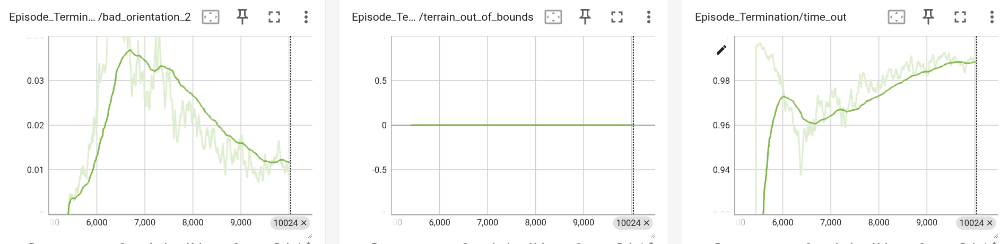 

## 项目依赖环境
### 硬件环境
- 操作系统：Ubuntu 22.04
- 运算平台：5070笔记本端（可以运行）实际训练放在服务器（4090）上
### 软件环境
- conda环境：python3.11.15
- isaaclab： 0.54.3
- isaacsim： 5.1.0.0
- rsl_rl: 5.0.1
## 编译安装方式

- isaaclab的下载可以参考nvidia官方的文档[installation guide](https://isaac-sim.github.io/IsaacLab/main/source/setup/installation/index.html)。

- 把这个项目安装在isaaclab项目外

  ```bash
  git clone https://github.com/Taojunfeng123/quadruped_robot_lab
  ```

- 要记得在isaaclab同一个conda环境中下载这个项目

  ```bash
  python -m pip install -e source/robot_lab
  ```

- 运行下面指令验证项目安装是否成功，查看可用环境:

  ```bash
  python scripts/tools/list_envs.py
  ```
## 项目结构
```
robot_lab/
├── README.md                    # 项目说明（中文）
├── CONTRIBUTORS.md              # 贡献者列表
├── LICENSE                      # 许可证 (BSD-3-Clause)
├── VERSION                      # 版本号 (2.3.2)
├── pyproject.toml               # 项目配置（ruff/pyright/pytest）
├── .pre-commit-config.yaml      # Git pre-commit 配置
├── .gitignore
├── .gitattributes
├── .dockerignore
├── docker/                      # Docker 容器配置
├── docs/                        # 项目文档 & 机器人图片
├── scripts/                     # 运行脚本（训练/工具）
├── source/                      # 源代码（pip editable install）
├── logs/                        # 训练日志 & 模型 checkpoint
└── outputs/                     # Hydra 输出目录（通常为空）
```

---

### 1. `docker/` — Docker 配置

```
docker/
├── .env.base                    # 环境变量
├── docker-compose.yaml          # docker compose 编排
└── Dockerfile                   # 镜像构建文件
```


---

### 3. `scripts/` — 运行脚本

```
scripts/
├── reinforcement_learning/          # RL 训练 & 推理脚本
│   ├── rl_utils.py                  # 通用 RL 工具函数
│   ├── rsl_rl/                      # rsl-rl 后端
│   │   ├── train.py                 # 训练入口
│   │   ├── play.py                  # 推理/评估入口
│   │   ├── play_cs.py               # 推理（camera stream）
│   │   └── cli_args.py              # 命令行参数解析
│   ├── skrl/                        # skrl 后端
│   │   ├── train.py
│   │   └── play.py
│   └── cusrl/                       # cusrl 后端
│       ├── train.py
│       └── play.py
└── tools/                           # 工具脚本
    ├── convert_urdf.py              # URDF 格式转换
    ├── convert_mjcf.py              # MJCF 格式转换
    ├── list_envs.py                 # 列出所有可用环境
    ├── random_agent.py              # 随机 agent 测试
    ├── zero_agent.py                # 零动作 agent 测试
    ├── clean_trash.py               # 清理临时文件
    └── beyondmimic/                 # BeyondMimic 相关工具
        ├── csv_to_npz.py            # CSV → NPZ 数据转换
        └── replay_npz.py            # NPZ 动作回放
```

#### 训练命令示例

```bash
# Rough 地形训练
python scripts/reinforcement_learning/rsl_rl/train.py --task=Rough-train --headless

# Stair 楼梯地形训练（续训）
python scripts/reinforcement_learning/rsl_rl/train.py --task=Stair-train --headless
```

---

### 4. `source/robot_lab/` — 源代码（pip editable install）

#### 4.1 包级文件

```
source/robot_lab/
├── setup.py                      # pip 安装配置
├── pyproject.toml
├── extension.toml                # Isaac Lab 扩展注册
├── config/                       # (空，扩展配置目录)
├── data/
│   └── Robots/                   # 机器人 URDF/Mesh 资产
│       ├── unitree/              #   宇树 (a1, b2, b2w, g1, go2, go2w, h1)
│       ├── deeprobotics/         #   深蓝 (lite3, m20)
│       ├── magiclab/             #   魔法实验室 (magicdog, magicdog_w, magicbot-Gen1, magicbot-Z1)
│       ├── zsibot/               #   之山 (zsl1, zsl1w)
│       ├── fftai/                #   傅利叶 (gr1t1, gr1t2)
│       ├── agibot/               #   智元 (d1)
│       ├── booster/              #   加速器 (t1)
│       ├── ddt/                  #   DDT (tita)
│       ├── openloong/            #   开龙 (loong)
│       ├── roboparty/            #   机器人派对 (atom01)
│       └── robotera/             #   机器人时代 (xbot)
└── robot_lab/                    # Python 包
    ├── __init__.py
    ├── ui_extension_example.py   # UI 扩展示例
    ├── assets/                   # 机器人资产定义（Python 配置类）
    └── tasks/                    # 任务定义
```

#### 4.2 `assets/` — 机器人资产配置

每个 `.py` 文件对应一个品牌的机器人，包含其在 Isaac Sim 中的 URDF 加载、关节配置、刚体定义等：

```
assets/
├── __init__.py
├── unitree.py                    # 宇树 (A1, Go2, B2, G1, H1, Go2W, B2W)
├── deeprobotics.py               # 深蓝 (Lite3, M20)
├── magiclab.py                   # 魔法实验室 (MagicDog, MagicDog_W, MagicBot)
├── zsibot.py                     # 之山 (ZSL1, ZSL1W)
├── fftai.py                      # 傅利叶 (GR1T1, GR1T2)
├── agibot.py                     # 智元 (D1)
├── booster.py                    # 加速器 (T1)
├── ddtrobot.py                   # DDT (Tita)
├── openloong.py                  # 开龙 (Loong)
├── roboparty.py                  # 机器人派对 (Atom01)
├── robotera.py                   # 机器人时代 (XBot)
└── my_dog.py                     # 自定义四足机器人
```

---

#### 4.3 `tasks/` — 任务定义

##### 4.3.1 任务总览

```
tasks/
├── __init__.py
├── manager_based/                # Manager-Based RL 任务
│   ├── locomotion/velocity/      #   Velocity 速度跟踪 locomotion
│   └── beyondmimic/              #   BeyondMimic 动作模仿
└── direct/                       # Direct RL 任务
    └── g1_amp/                   #   G1 AMP (Adversarial Motion Priors)
```

##### 4.3.2 `locomotion/velocity/` — 速度跟踪行走（核心任务）

这是项目的核心任务类型，基于 Isaac Lab 的 `ManagerBasedRLEnv`。

```
locomotion/velocity/
├── __init__.py
├── velocity_env_cfg.py           # 基础环境配置类
├── config/                       # 各机器人的环境 + agent 配置
│   ├── __init__.py
│   ├── quadruped/                # 四足机器人
│   │   ├── my_dog/               #   自定义四足
│   ├── humanoid/                 # 双足人形机器人
│   │   ├── unitree_g1/           #   宇树 G1
│   │   ├── unitree_h1/           #   宇树 H1
│   │   ├── booster_t1/           #   加速器 T1
│   │   ├── fftai_gr1t1/          #   傅利叶 GR1T1
│   │   ├── fftai_gr1t2/          #   傅利叶 GR1T2
│   │   ├── magiclab_magicbot_gen1/
│   │   ├── magiclab_magicbot_z1/
│   │   ├── openloong_loong/      #   开龙
│   │   ├── roboparty_atom01/
│   │   └── robotera_xbot/
│   ├── wheeled/                  # 轮式机器人
│   │   ├── unitree_b2w/          #   宇树 B2W
│   │   ├── unitree_go2w/         #   宇树 Go2W
│   │   ├── ddtrobot_tita/        #   DDT Tita
│   │   ├── deeprobotics_m20/     #   深蓝 M20
│   │   ├── magiclab_magicdogw/   #   魔法实验室 MagicDog_W
│   │   └── zsibot_zsl1w/         #   之山 ZSL1W
│   └── others/                   # 特殊任务
│       └── unitree_a1_handstand/ #   A1 倒立
└── mdp/                          # MDP 组件（观测/奖励/命令/事件等）
    ├── __init__.py
    ├── commands.py               # 速度命令生成
    ├── observations.py           # 观测空间定义
    ├── rewards.py                # 奖励函数
    ├── events.py                 # 事件/随机化
    ├── curriculums.py            # 课程学习
    ├── utils.py                  # 工具函数
    └── symmetry/                 # 对称性数据增强
        ├── __init__.py
        └── anymal.py
```

每个机器人配置目录的标准结构：

```
config/<category>/<robot_name>/
├── __init__.py
├── flat_env_cfg.py               # 平地环境配置
├── rough_env_cfg.py              # 崎岖地形环境配置
└── agents/                       # RL 算法配置
    ├── __init__.py
    ├── rsl_rl_ppo_cfg.py         # rsl-rl PPO 配置
    └── cusrl_ppo_cfg.py          # cusrl PPO 配置 (部分机器人有)
```


### 5. `logs/` — 训练日志（真正有内容）
- 放训练记录和模型的

## **系统框图和数据流图**
### 1. 总体系统架构框图

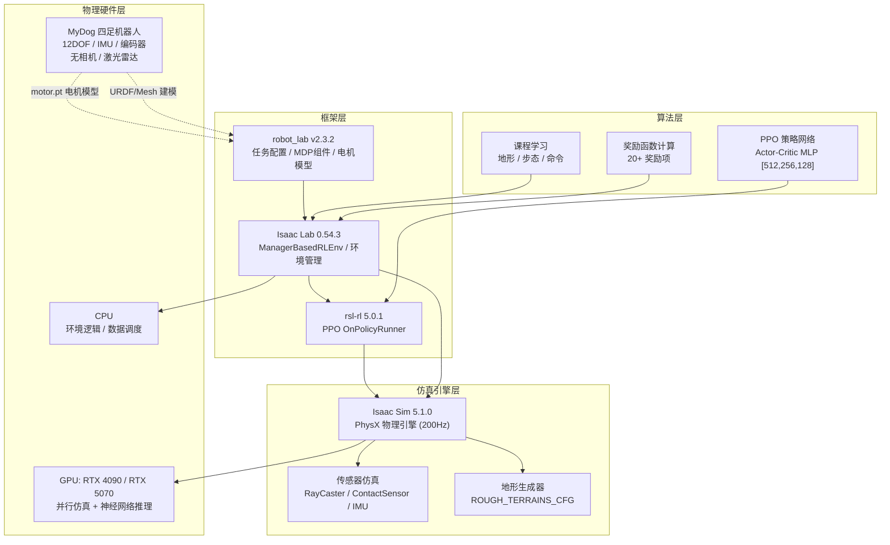

---

### 2. 软硬件协同框图

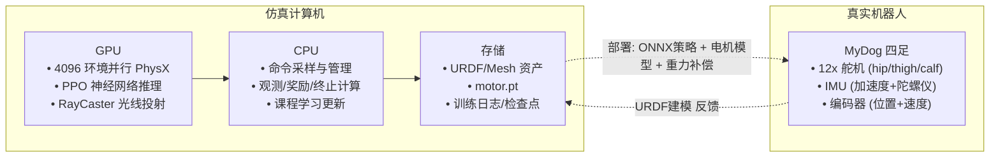

---

### 3. 训练数据流图

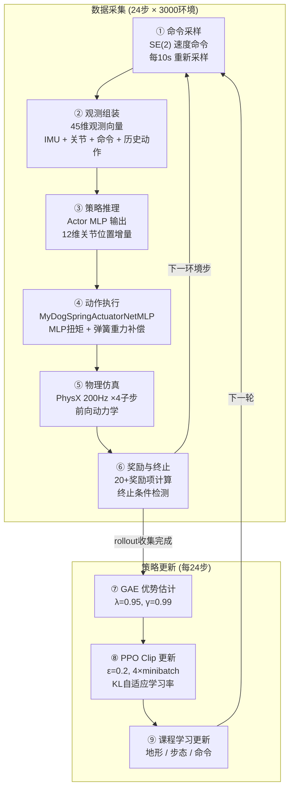

---

### 4. 单步推理数据流 (观测 → 动作 → 力矩)


---

### 5. 奖励信号数据流

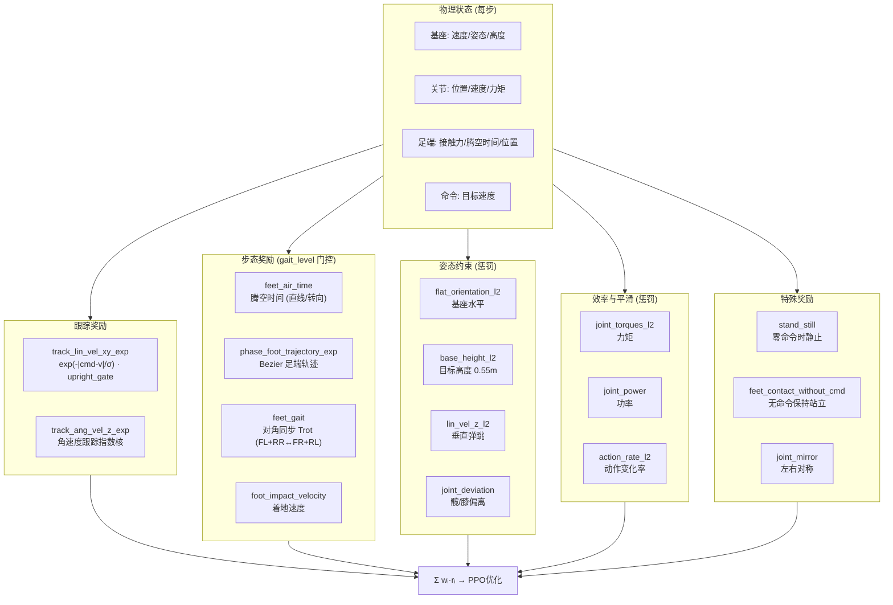

---

### 6. 课程学习数据流

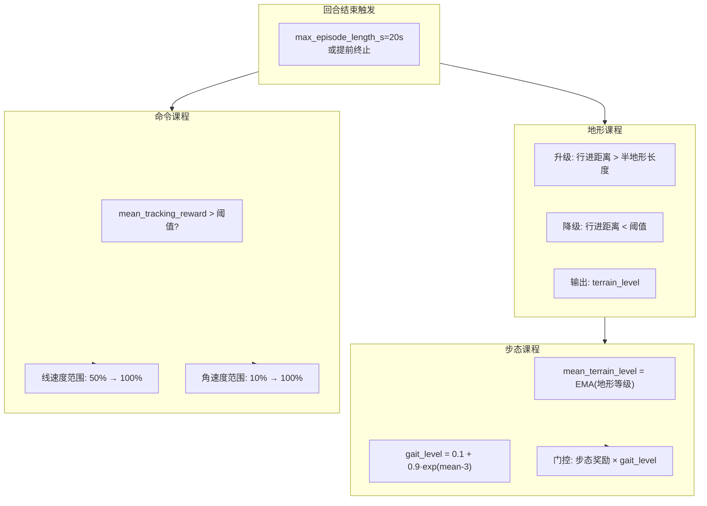

---

### 7. 周期性停止机制

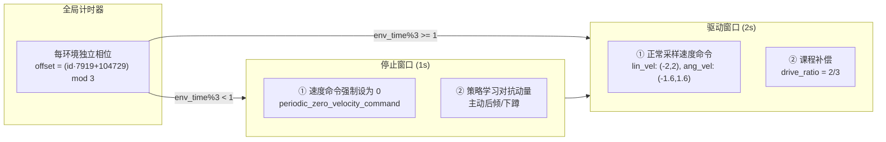
## **原理介绍以及理论支撑**
---

### 1. PPO 近端策略优化算法

#### 1.1 算法背景

PPO (Proximal Policy Optimization, Schulman et al., 2017) 是目前强化学习中最广泛使用的策略梯度算法之一。本项目使用 **rsl-rl 5.0.1** 中的 PPO 实现 (`OnPolicyRunner`)，用于训练四足机器人 MyDog 的速度跟踪运动策略。

#### 1.2 核心思想

PPO 解决的是策略梯度方法中**步长敏感**的问题：策略更新过大可能导致性能崩溃，过小则收敛缓慢。PPO 通过**裁剪 (Clipping)** 机制限制每次更新的幅度，使得新策略不会偏离旧策略太远。

#### 1.3 目标函数

**Clipped Surrogate Objective:**

$$L^{CLIP}(\theta) = \mathbb{E}_t \left[ \min\left( r_t(\theta) \hat{A}_t, \text{clip}(r_t(\theta), 1-\epsilon, 1+\epsilon) \hat{A}_t \right) \right]$$

其中：
- $r_t(\theta) = \frac{\pi_\theta(a_t|s_t)}{\pi_{\theta_{old}}(a_t|s_t)}$ 是新旧策略的概率比
- $\hat{A}_t$ 是广义优势估计 (GAE)
- $\epsilon = 0.2$ 是裁剪范围 (clip_param)

**直觉理解：**
- 当优势 $\hat{A}_t > 0$ (动作比预期好): $r_t$ 被限制最大为 $1+\epsilon$，防止过度增加该动作概率
- 当优势 $\hat{A}_t < 0$ (动作比预期差): $r_t$ 被限制最小为 $1-\epsilon$，防止过度降低该动作概率

#### 1.4 完整损失函数

$$\mathcal{L} = \mathbb{E}_t \left[ L^{CLIP}(\theta) - c_1 L^{VF}(\phi) + c_2 S[\pi_\theta](s_t) \right]$$

| 项 | 含义 | 本项目值 |
|----|------|---------|
| $L^{CLIP}$ | 裁剪策略损失 | clip_param = 0.2 |
| $L^{VF}$ | 价值函数 MSE 损失 | value_loss_coef = 1.0 |
| $S[\pi_\theta]$ | 熵奖励 (鼓励探索) | ent_coef = 0.01 |

### 2. Actor-Critic 架构与网络设计

#### 2.1 网络结构

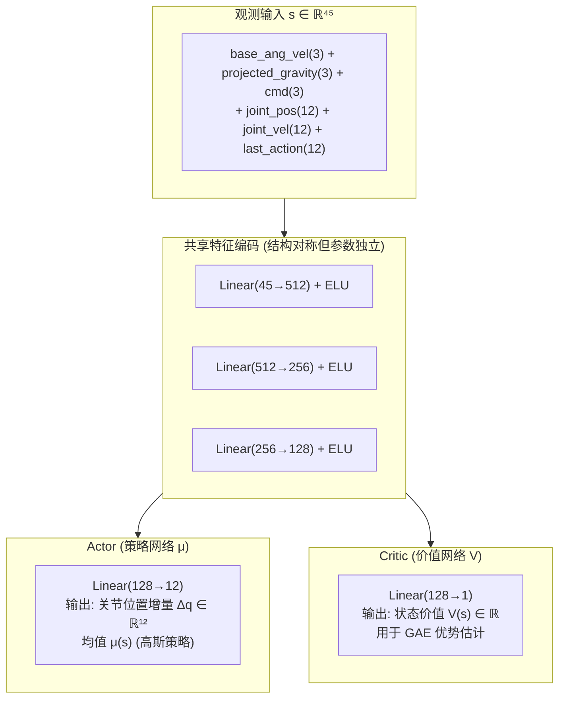

#### 2.2 设计选择的理论依据

**ELU (Exponential Linear Unit) 激活函数：**
$$\text{ELU}(x) = \begin{cases} x & \text{if } x > 0 \\ \alpha(e^x - 1) & \text{if } x \leq 0 \end{cases}$$

相比 ReLU，ELU 在负区域有非零输出，能够：
- 保持负输入的梯度流动
- 输出均值接近 0，加速收敛
- 在连续控制任务 (如机器人运动) 中表现更平滑

**三层递减结构 [512, 256, 128]：**
- 第一层宽 (512)：充分提取观测空间的复杂特征
- 逐层递减：强制网络学习紧凑的层次化表示
- 最后一层窄 (128)：在到达输出层前进行信息压缩

---

### 3. 域随机化 (Domain Randomization)

#### 3.1 理论基础

域随机化 (Tobin et al., 2017; Peng et al., 2018) 通过在仿真中随机化物理参数，迫使策略学习对参数变化不敏感的鲁棒行为，从而实现从仿真到真实世界的零样本迁移 (zero-shot sim-to-real transfer)。

#### 3.2 数学表述

在每次环境重置和训练过程中，从先验分布中采样动力学参数 $\xi \sim P(\Xi)$：

$$\max_\theta \mathbb{E}_{\xi \sim P(\Xi)} \left[ \mathbb{E}_{\tau \sim p(\tau|\pi_\theta, \xi)} \left[ \sum_t \gamma^t r(s_t, a_t) \right] \right]$$

### 3.3 分层随机化策略

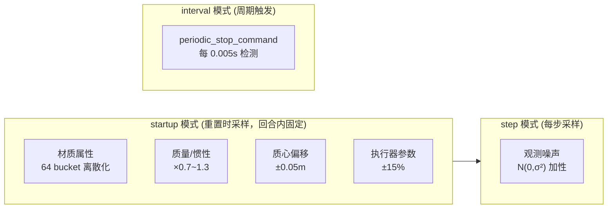

---

### 4. 课程学习 (Curriculum Learning)

#### 4.1 理论基础

课程学习 (Bengio et al., 2009) 模仿人类学习过程，从简单任务开始逐步过渡到困难任务。在 RL 中，课程学习可以通过动态调整环境参数来实现，使智能体在难度适中的条件下持续获得有效的学习信号。个人理解是为了贴合奖励函数的设计哲学--稠密奖励，课程前期难度较低，容易得到较高奖励，使得奖励稠密引导policy朝着我们想要的方向学习。

#### 4.2 地形课程 (Terrain Curriculum)

**升级条件:**
$$d_{traveled} > \frac{1}{2} \cdot L_{terrain}$$

**降级条件:**
$$d_{traveled} < \text{cmd}_{norm} \cdot T_{episode} \cdot \text{drive\_ratio} \cdot 0.5$$

当行进距离远低于期望值时 (考虑周期性停止的驱动比例)，地形难度 -1。

- 地形课程学习就是看机器人移动距离能不能到达理论最大的百分之几十，如果到达就提高地形难度。因为我自己添加了  `periodic_stop_command`事件所以会导致速度奖励项目跑不满所以我给地形课程学习添加了配合periodic_stop_command的接口
```
self.curriculum.terrain_levels.params["stop_cycle_period"] = 3
self.curriculum.terrain_levels.params["stop_duration"] = 1
```
**理论意义：**
- 自动调节难度使策略始终在 "最近发展区" 学习
- 防止灾难性遗忘 (通过降级机制回到已掌握的地形)

#### 4.3 步态课程 (Gait Curriculum)

**动机:** 步态优化 (如腾空时间、足端轨迹) 对初学者是有害的——在学会基本站立和移动之前，复杂的步态奖励只会产生噪声梯度。

**机制:** 步态奖励权重由全局 `gait_level ∈ [0, 1]` 门控：

$$gait\_level = 0.1 + 0.9 \cdot \exp(mean\_terrain\_level - 3)$$

| 阶段 | mean_terrain | gait_level | 步态奖励影响 |
|------|-------------|------------|------------|
| 早期 | 0 | ~0.11 | 几乎无影响，专注基本运动 |
| 中期 | 2 | ~0.44 | 中等影响，开始塑形步态 |
| 后期 | 3+ | →1.0 | 完全生效，精细化步态 |

#### 4.4 命令课程 (Command Curriculum)

**机制:** 当前速度跟踪奖励 > 阈值时，逐步扩展速度/角速度命令的范围。

| 阶段 | 线速度范围 (%) | 角速度范围 (%) |
|------|---------------|---------------|
| 初始 | 50% | ~32% |
| 最终 | 100% | 100% |

**周期性停止补偿:** 因为存在 `periodic_stop_command` (1s 停止 / 3s 周期)，奖励信号在停止窗口期间自然会降低。课程通过 `drive_ratio` 补偿：
$$threshold_{effective} = threshold \div drive\_ratio$$

---

### 5. 奖励函数设计

#### 5.1 奖励设计哲学
在和挺多人交流下来发现，包括我自己，在刚开始学习rl的时候有点太过于重视奖励函数的设计和参数调整了，在这段时间的学习和交流中我发现有些时候死磕奖励函数不如去捉摸一下怎么去从event，curriculums和terminal方面去着手改变，奖励函数当然重要，但并不是决定一切的。初期学习和调试中，我对于奖励函数的设计和调参感到困惑，觉得这个是个没有方法论可言的纯调参，你经历过对着tensorboard调十几个奖励函数的绝望吗。。。。。。。。。。。。

下面是我在自己的学习过程中加上看一些文档，和一些大佬交流中的出的一些可以参考的奖励函数方法论着重于怎么设计一个自己想要的奖励函数：

1. **稠密奖励 (Dense Reward):** 每一步都提供梯度信号，加速学习
2. **指数核 (Exponential Kernel):** $\exp(-|error|/\sigma)$ 形式，对小误差敏感，对大误差梯度趋于 0
3. **条件门控 (Conditional Gating):** 只在机器人在正确状态时才激活相关奖励
4. **多目标平衡:** 通过权重调节跟踪精度、能效、姿态、步态的关系

关于调参：

一方面我觉的参数大小其实是因为量纲的存在，还有一方面就是根据自己想要训出什么特点，或者训练中出现了什么问题来进行调整。

#### 5.2 核心跟踪奖励

**线速度跟踪 (指数核):**

$$r{lin\_vel} = \exp\left(-\frac{|v_{xy}^{cmd} - v——{xy}^{actual}|^2}{\sigma_{lin}^2}\right) \cdot \text{upright\_gate}$$

**角速度跟踪 (指数核):**

$$r{ang\_vel} = \exp\left(-\frac{|\omega_z^{cmd} - \omega_z^{actual}|^2}{\sigma_{ang}^2}\right) \cdot \text{upright\_gate}$$

**姿态门控 (Upright Gate):**

$$\text{upright\_gate} = \frac{\text{clamp}(-\text{proj\_gravity}_z, 0, 0.7)}{0.7}$$

### 6. 步态相位与足端轨迹优化

#### 6.1 相位表示

每个足端有一个相位 $\phi_i \in [0, 1]$，表示在步态周期中的位置：

$$\phi_i(t) = \frac{t}{T_{cycle}} + \phi_i^{offset} \pmod{1}$$

**Trot 步态相位偏移 (本项目配置):**

| 足端 | 相位偏移 | 分组 |
|------|---------|------|
| FL (前左) | 0 | 组 A |
| FR (前右) | 1 (即 0) | 组 B |
| RL (后左) | 1 (即 0) | 组 B |
| RR (后右) | 0 | 组 A |

即 **(FL+RR) 同步**, **(FR+RL) 同步**, 两组交替 → **对角小跑 (trot)**。

#### 6.2 Bernstein/Bezier 足端轨迹

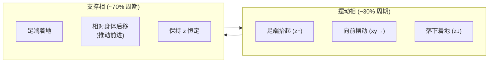

步态轨迹参数 (本项目):

| 参数 | 值 | 说明 |
|------|-----|------|
| cycle_time | 0.425 s | 完整步态周期 |
| phase_offsets | (0, 1, 1, 0) | 对角 Trot 偏移 |
| gait_span | 0.0 | X 方向摆动跨度 |
| gait_psi | 0.05 m | 抬脚高度 |
| gait_delta | 0.02 m | Z 轨迹偏置 |

#### 6.3 步态奖励的数学表述

$$r_{gait} = \sum_{i \in feet} \exp\left(-\frac{|p_i^{ideal}(\phi_i) - p_i^{actual}|}{\sigma_{foot}}\right)$$

其中 $p_i^{ideal}(\phi_i)$ 是相位 $\phi_i$ 处的 Bézier 曲线理想位置。

---

### 7. 执行器网络与 Sim-to-Real 迁移

#### 7.1 问题背景

真实机器人 MyDog 的电机存在控制误差、响应延迟和非线性特性。直接用 PD 控制器输出的力矩在仿真中完美执行，但在真实机器人上会导致剧烈振动，也就是sim2real gap为了解决仿真中的电机和现实中的差异，我们加入了执行器网络拟合了真实的电机数据。

#### 7.2 执行器网络架构

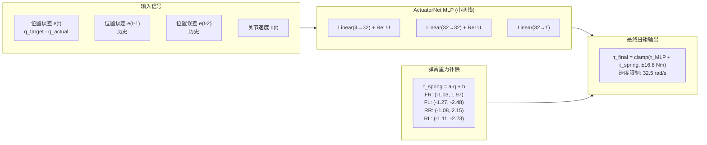
#### 7.3 执行器网络的训练
- 使用了ActuatorNetMLP 基类，该方法源自论文 "Learning
  Agile and Dynamic Motor Skills for Legged Robots" (Hwangbo et al., 
  2019)。其核心思路是：
1. 数据采集：

      在真实机器人上采集电机数据，具体做法是：
  - 向真实电机的 PD 控制器发送随机的目标位置序列（覆盖关节的运动范围）
  - 记录每一步的：目标位置 $q_{target}$、实际位置 $q_{actual}$、关节速度
  $\dot{q}$，以及 PD 控制器输出的实际力矩 $\tau_{actual}$
  - 这构成了监督学习的训练数据：输入 = [位置误差历史, 速度历史]，标签 = 实际力矩

  2. 网络训练：

    用采集到的真实数据训练一个小型 MLP (6→32→32→1)，损失函数是 MSE：
$$\mathcal{L} = |\tau_{MLP} - \tau_{actual}|^2$$


---

### 8. 周期性停止命令与鲁棒性

#### 8.1 问题背景

常规的速度跟踪训练中，策略收到的速度指令是持续的，导致训出来的policy在速度急停急起时的表现和稳定性差强人意，而rc障碍赛和任务赛都存在要稳定的加速和停下的场景，所以我在第一轮常规训练出稳定行走模型后，加入坡度和周期停止的命令让policy学会稳定急停急起。为什么不在第一轮就加呢，我有尝试过，但发现收敛速度慢且行走步态怪怪的，我反思觉得是因为周期性停止命令引入了噪声，要素过多破坏了奖励的稠密性。

#### 8.2 机制设计

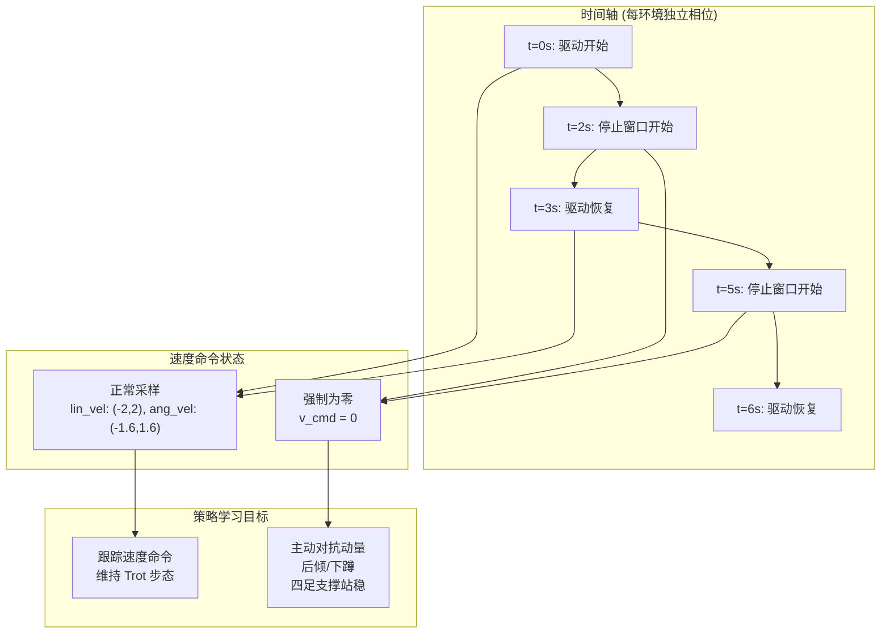

---

## 10. GAE 广义优势估计

### 10.1 理论定义

GAE (Generalized Advantage Estimation, Schulman et al., 2016) 提供了一种在偏差-方差之间平滑插值的方法：

$$\hat{A}_t^{GAE(\gamma, \lambda)} = \sum_{l=0}^{\infty} (\gamma\lambda)^l \delta_{t+l}$$

其中 TD 误差:
$$\delta_t = r_t + \gamma V(s_{t+1}) - V(s_t)$$

### 10.2 λ 参数的意义

- **λ = 0:** 一步 TD 误差 (低方差, 高偏差) → $\hat{A}_t = \delta_t$
- **λ = 1:** 蒙特卡洛估计 (高方差, 低偏差) → $\hat{A}_t = \sum \gamma^l r_{t+l} - V(s_t)$
- **λ = 0.95 (本项目):** 接近 MC 但带有正则化，在实践中通常效果最好
## **软件架构**
### 1. 训练结构
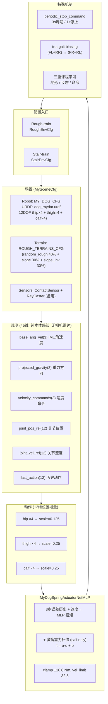
### 2. 软件层级图

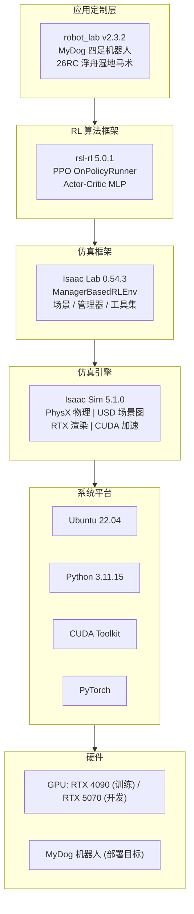

---
## 训练流程 
1.rough环境训练到gait_leval，command_leval，terrain_leval学满。
- 第一轮关闭period_stop只用random_rough环境训练
- 第二轮开启period_rtop加入斜坡地形训练
```bash
python scripts/reinforcement_learning/rsl_rl/train.py   --task=Rough-train --headless
```
2.用rough环境训练出来的模型去stair地形继续训练
-
```bash
python scripts/reinforcement_learning/rsl_rl/train.py   --task=Stair-train --headless
```
## **机器人配置文件**
1. 由于第一次2real时候gap太大，电机抖动剧烈，我们采集了真实电机数据用mlp网络去做拟合，在配置文件中使用`MyDogSpringActuatorNetMLP`作为电机执行器。

2. 因为电机力矩不够，我们采用了小腿拉弹簧做重力补偿的方式解决，所以在配置文件中我们真实拟合的弹簧加入到`MyDogSpringActuatorNetMLP`网络中。
##  未来优化的方向（RoadMap）
1. 没有做轮足的训练，这也可以说是我们这个赛季的小遗憾，没有搞出更适合今年赛题的轮足
2. 没有在网络结构下进一步优化，如历史coder和decoder，moe-cts，其实我在critic-actor的结构下感觉效果已经不错了
3. 我有搓高墙地形的盲过，但是稳定性特别差，后面没有坚持下去，因为我觉得可能得加视觉感知才行，后面去复现parkour效果也没有很理想，剩下最后一个月时间我也没有信心能解决gap问题所以放弃。上述两个尝试我自己的代码就不放出来献丑了。放西南交通大学的同学的盲过高墙展示一下（他说他也是critic-actor）
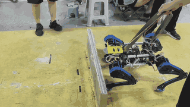
4. 没有弄出视觉感知方案，大一确实技术能力没有那么强，没有搞出来。